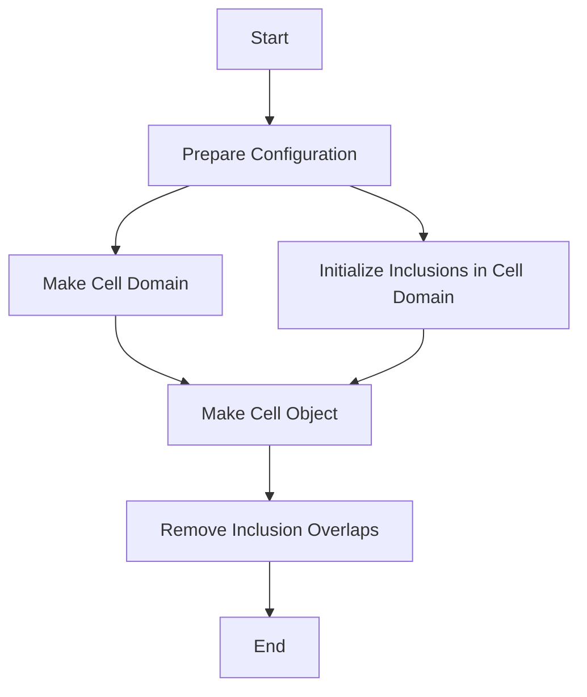
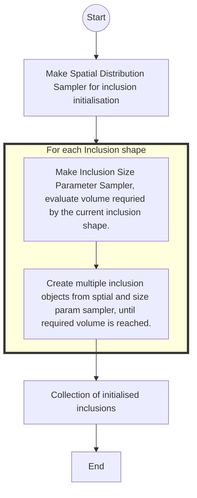
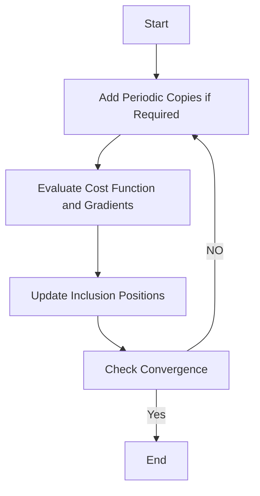

# Flow of Events

## Generating a Cell

```mermaid
graph TD;
    A["Start"]-->B["Prepare Configuration"];
    B-->C["Make Cell Domain"];
    B-->D["Initialize Inclusions in Cell Domain"];
    C-->F["Make Cell Object"];
    D-->F;
    F-->G["Remove Inclusion Overlaps"];
    G-->H["End"];
```

## Initializing Inclusions

```mermaid
graph TD;
    A(("Start"))-->B["Make Spatial Distribution Sampler for inclusion initialisation"];
    subgraph C["For each Inclusion shape"];
        style C stroke:#333,stroke-width:4px;
        C1["Make Inclusion Size Parameter Sampler, evaluate volume requried by the current inclusion shape."]-->C2["Create multiple inclusion objects from sptial and size param sampler, until required volume is reached."];
    end
    B --> C;
    C2 --> D["Collection of initialised inclusions"];
    D-->E["End"];
```

## Events in "Inclusion Overlap Removal"

```mermaid
graph TD;
    A["Start"]-->B["Add Periodic Copies if Required"];
    B-->C["Evaluate Cost Function and Gradients"];
    C-->D["Update Inclusion Positions"];
    D-->E["Check Convergence"];
    E -- "NO" --> B;
    E -- "Yes" -->F["End"];
```
